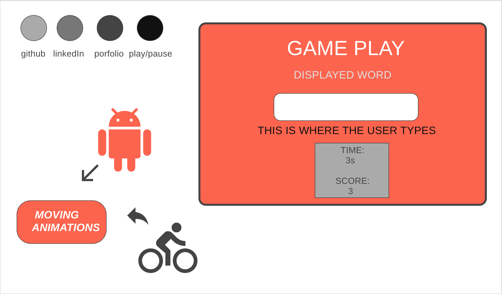

# Typing After Dark
        A simple typing game with some lofi and midnight solace kinda feel.  Enjoy!
https://mjfung1.github.io/Typing-after-dark/

## Functionality/MVP

### The game starts on load.  User will be presented with beautifull animations. 
        The game starts as soon as the page loads, so get ready!
                1. To play again: just type the current word and score will reset.
                2. Borders will light green if correct, and red if incorrect
        Animations
                1. Bicycle wheels around its x-axis
                2. Person moves up and down on its y-axis
                3. The spacecraft and the light beam rotate on its x-axis with constraint.
        
                
## Wireframes

## Artchitecture and Technologies
        This project is built with HTML, CSS, and vanilla JavaScript.

## Gameplay
<!--  -->

## Implementation and Timeline

## Future implementations 
 - SVG objects reacting to the game
 - Choosing between typing quotes or words
 - Add different time limit levels
